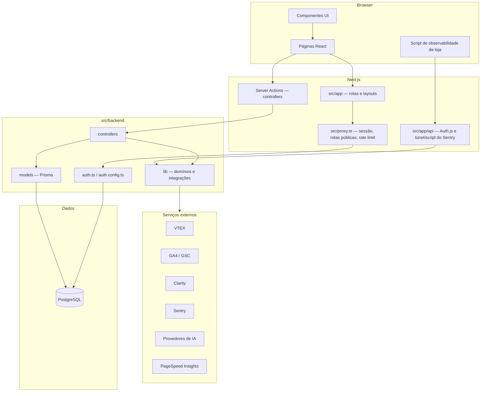

# Cry Console

Plataforma B2B para gestores de e-commerce conectarem **VTEX**, **GA4**, **Clarity** e **Google Search Console** às suas lojas e obterem insights de negócio, metas com acompanhamento de ritmo, auditorias de SEO/CRO, observabilidade do site (via **Sentry**) e um **agente de IA** que conversa sobre os dados da loja.

Este repositório é um monólito **Next.js** com separação explícita entre **backend** (`src/backend`) e **frontend** (`src/frontend`), orquestrado pelo App Router em `src/app`.

## Funcionalidades

| Área | Rota | O que faz |
|------|------|-----------|
| Autenticação | `/entrar`, `/cadastro`, `/esqueci-senha`, `/redefinir-senha` | Login com Google ou e-mail/senha, recuperação de senha |
| Dashboard | `/dashboard` | Visão geral da loja ativa e status das fontes |
| Lojas | `/lojas`, `/lojas/nova`, `/lojas/[id]` | Cadastro de lojas (workspaces) e credenciais VTEX, GA4 (service account) e Clarity, criptografadas no banco |
| Avisos | `/lojas/[id]/avisos` | Metas semanais/mensais por métrica, com **mínimo esperado** e **meta**: zona atual (abaixo do mínimo, na faixa, no ritmo da meta) e risco da projeção |
| Análise | `/lojas/[id]/analise` | Coleta de métricas, heurísticas e scoring com apoio de LLM |
| SEO / CRO | `/lojas/[id]/seo`, `/lojas/[id]/cro` | Auditoria por papel de página (home, categoria, produto, busca) com PageSpeed mobile/desktop e checklist de SEO |
| Observabilidade | `/lojas/[id]/observabilidade` | Issues JavaScript, Web Vitals e replays do Sentry, com severidade, diagnóstico e filtros por período e tipo de página |
| Agente | `/agente`, `/agente/[sessionId]` | Chat com modos **Ask**, **Plan** e **Agent**, gráficos, projeções, funil, plano de ação, skills do usuário e contexto do Sentry |

### Provedores de IA

O usuário configura tokens próprios em **Configurações da conta** (DeepSeek, OpenAI, Anthropic, Google Gemini, Grok/xAI ou um provedor compatível com OpenAI). Para provedores conhecidos, o modelo é escolhido no seletor do chat a partir de um catálogo fixo (`backend/lib/ai/provider-catalog.ts`); no provedor personalizado, o modelo é informado nas configurações. Também há o **Gemini da plataforma** (`GEMINI_API_KEY`) e o modelo nativo do Chrome (Prompt API) no navegador.

### Observabilidade (Sentry)

Cada loja recebe um projeto Sentry criado pelo console. O script de captura é servido por `/api/observability/script/[publicKey]` e os eventos passam pelo túnel `/api/observability/tunnel/[publicKey]` (com scrub e rate limit). A página de observabilidade e o agente leem issues, vitals e replays pela API do Sentry, com cache em memória de 60 s.

## Stack

| Camada | Tecnologias |
|--------|-------------|
| Runtime | Node.js 22, **pnpm** |
| Framework | **Next.js 16** (App Router, React 19) |
| UI | **Tailwind CSS 4**, **shadcn/ui** (Base UI), Lucide, Recharts, react-markdown |
| Auth | **Auth.js** (`next-auth` v5), Google OAuth, credenciais (e-mail/senha) |
| Dados | **PostgreSQL**, **Prisma 7** (`@prisma/adapter-pg`) |
| IA | Gemini (`@google/genai`), APIs OpenAI-compatible, Anthropic |
| Validação | **Zod** |
| Testes | **Vitest** (+ Testing Library/jsdom), **Playwright** (E2E) |
| Qualidade | ESLint (`eslint-config-next`), TypeScript |
| Deploy | Vercel (via GitHub Actions) |

## Arquitetura



### Fluxo de requisição (páginas)

1. **`src/proxy.ts`** — ponto de entrada para rotas de página (equivalente ao middleware clássico no Next 16). Encapsula `auth()`, aplica **rate limit** em rotas de autenticação e redireciona conforme `backend/lib/proxy/routes.ts` e `backend/lib/proxy/policy.ts`.
2. **`src/app`** — layouts, metadados e páginas. Grupos de rota:
   - **`(public)`** — login, cadastro, recuperação de senha (layout split com hero).
   - **`(private)`** — área autenticada: dashboard, lojas e agente.
3. **Server Actions** em `src/backend/controllers` — mutações com validação Zod; leituras server-side que não devem virar POST (ex.: `observability-query.ts`) também ficam ali, sem `"use server"`.

### Backend (`src/backend`)

| Pasta / arquivo | Responsabilidade |
|-----------------|------------------|
| `auth.ts`, `auth.config.ts` | Configuração Auth.js, adapter Prisma, callbacks (OAuth vs senha, `session.user.id`) |
| `controllers/` | Server Actions (`"use server"`) e leituras server-side — orquestram casos de uso |
| `models/` | Acesso a dados (Prisma) por entidade — usuário, lojas, métricas, agente, observabilidade… |
| `lib/<domínio>/` | Regras puras e clientes de integração, organizados por domínio (ver [AGENTS.md](./AGENTS.md)) |

O client Prisma é gerado em `src/generated/prisma` (ver `prisma/schema.prisma`).

### Frontend (`src/frontend`)

Organização inspirada em **atomic design**, com primitivos shadcn em `components/ui`:

| Camada | Exemplos |
|--------|----------|
| `atoms/` | `form-field`, `password-input`, `brand-logo`, `range-bar` |
| `molecules/` | `aviso-metric-card`, `observability-issue-card`, `account-settings-provider-card` |
| `organisms/` | `login-form`, `agent-chat-board`, `agent-composer`, `observability-board` |
| `templates/` | `auth-split-layout`, `auth-card-template` |
| `navigation/` | menus da área privada e ações por loja (`workspace-actions.ts`) |
| `lib/`, `hooks/` | `utils` (`cn`), helpers do agente e do browser, `use-mobile` |

Páginas em `src/app` devem permanecer finas: compõem templates/organisms e delegam submit às Server Actions.

### Autenticação e rotas

- **Rotas públicas** (definidas em `backend/lib/proxy/routes.ts`): `/`, `/entrar`, `/cadastro`, `/esqueci-senha`, `/redefinir-senha`.
- **Não autenticado** em rota privada → redirect para `/entrar?to=...`.
- **Autenticado** em rota pública com `whenAuthenticated: "redirect"` → dashboard ou `to` sanitizado.
- **API Auth.js**: `src/app/api/auth/[...nextauth]/route.ts`.

## Estrutura de pastas (resumo)

```
cry_console/
├── prisma/                 # schema e migrations
├── public/brand/           # assets de marca
├── scripts/                # utilitários (ex.: export de logo)
├── src/
│   ├── app/                # App Router, API routes, estilos globais
│   ├── backend/            # auth, controllers, models, lib por domínio
│   ├── frontend/           # componentes, navegação, hooks e lib de UI
│   ├── generated/prisma/   # client gerado (não editar)
│   └── proxy.ts            # proxy de sessão e políticas de rota
├── tests/e2e/              # testes Playwright
└── .github/workflows/      # CI/CD
```

## Desenvolvimento

### Pré-requisitos

- Node.js 22+
- pnpm 12+
- PostgreSQL (local ou Supabase)

### Configuração

```bash
cp .env.example .env
# Preencha ao menos DATABASE_URL, DIRECT_URL, AUTH_SECRET, AUTH_URL e CREDENTIALS_ENCRYPTION_KEY

pnpm install
pnpm exec prisma migrate dev
pnpm dev
```

A aplicação sobe em [http://localhost:3000](http://localhost:3000).

### Scripts

| Comando | Descrição |
|---------|-----------|
| `pnpm dev` | Servidor de desenvolvimento |
| `pnpm build` | `prisma generate` + build de produção |
| `pnpm start` | Servidor de produção |
| `pnpm lint` | ESLint |
| `pnpm typecheck` | `tsc --noEmit` |
| `pnpm test` | `prisma generate` + Vitest (unitário e componentes) |
| `pnpm test:watch` | Vitest em modo watch |
| `pnpm test:e2e` | Playwright (`tests/e2e/`) |
| `pnpm prisma:generate` | Gera o client Prisma |
| `pnpm prisma:migrate` | `prisma migrate dev` |
| `pnpm brand:export-logo` | Exporta assets de logo a partir do SVG |

### Variáveis de ambiente

Ver `.env.example`:

| Variável | Uso |
|----------|-----|
| `DATABASE_URL` | Conexão da aplicação (ex.: pooler Supabase) |
| `DIRECT_URL` | Conexão direta para migrations (`prisma.config.ts`) |
| `AUTH_SECRET`, `AUTH_URL` | Auth.js; `AUTH_URL` também é a origem pública usada no script de observabilidade |
| `AUTH_GOOGLE_ID`, `AUTH_GOOGLE_SECRET` | Login social (opcional) |
| `CREDENTIALS_ENCRYPTION_KEY` | 32 bytes em base64 — criptografa credenciais das lojas e tokens de IA |
| `SENTRY_ORG_SLUG`, `SENTRY_TEAM_SLUG`, `SENTRY_AUTH_TOKEN` | Observabilidade. O token deve ser de uma **Internal Integration** (não Organization Auth Token `sntrys_`) com Organization Read, Team Read, Project Admin e **Event Read** |
| `GEMINI_API_KEY`, `GEMINI_MODEL` | Gemini da plataforma (opcional) |
| `PAGESPEED_API_KEY` | PageSpeed Insights na auditoria SEO/CRO (opcional; sem chave a cota é menor) |

## CI/CD

- **CI** (`.github/workflows/ci.yml`) — em push/PR: `prisma generate`, `lint`, `typecheck`, `test` e `build`, com variáveis de placeholder para auth e banco.
- **CD** (`.github/workflows/cd.yml`) — após CI verde em push para `main`/`master`, faz build e deploy de produção na Vercel.

## Roadmap (produto)

Aprofundar as integrações analíticas (GA4, Clarity, GSC), novos conectores de e-commerce além da VTEX e agentes de estratégia comercial, SEO e CRO.

<!-- "demo:html": "npx --yes serve exemplo_html -p 4173" -->
