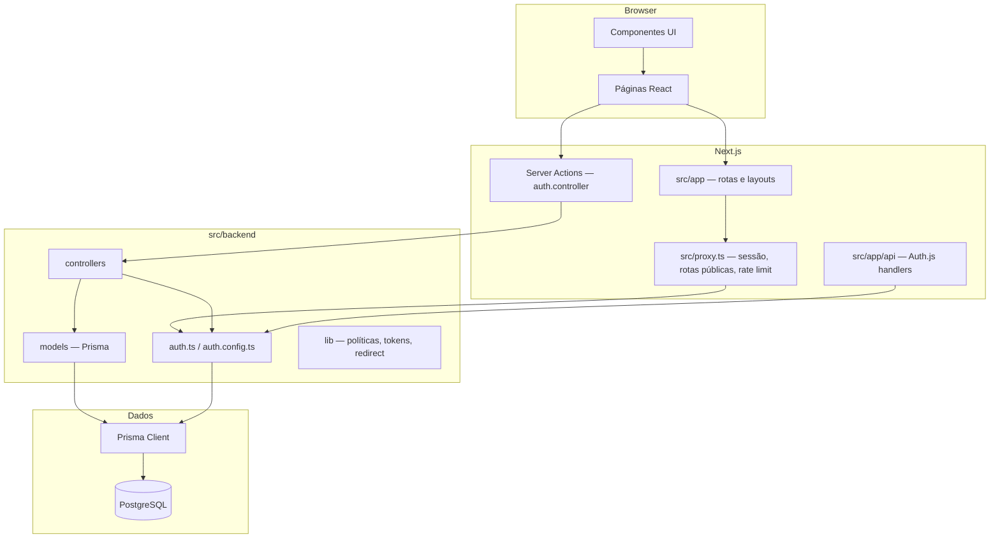

# Cry Console

Plataforma para gestores de e-commerce conectarem **GA4**, **Clarity**, **Google Search Console** e **VTEX** (fase inicial) e obterem insights de negócio. A visão de produto inclui observabilidade e agentes para estratégias comerciais, SEO e CRO.

Este repositório é um monólito **Next.js** com separação explícita entre **backend** (`src/backend`) e **frontend** (`src/frontend`), orquestrado pelo App Router em `src/app`.

## Stack

| Camada | Tecnologias |
|--------|-------------|
| Runtime | Node.js 22, **pnpm** |
| Framework | **Next.js 16** (App Router, React 19) |
| UI | **Tailwind CSS 4**, **shadcn/ui** (Base UI), Lucide |
| Auth | **Auth.js** (`next-auth` v5), Google OAuth, credenciais (e-mail/senha) |
| Dados | **PostgreSQL**, **Prisma 7** (`@prisma/adapter-pg`) |
| Validação | **Zod** |
| Testes | **Vitest** |
| Qualidade | ESLint (`eslint-config-next`), TypeScript |

## Arquitetura



### Fluxo de requisição (páginas)

1. **`src/proxy.ts`** — ponto de entrada para rotas de página (equivalente ao middleware clássico no Next 16). Encapsula `auth()`, aplica **rate limit** em rotas de autenticação, redireciona visitantes não autenticados e usuários logados nas rotas públicas conforme `proxy-policy` / `proxy-routes`.
2. **`src/app`** — define layouts, metadados e páginas. Grupos de rota:
   - **`(public)`** — login, cadastro, recuperação de senha (layout split com hero).
   - **`(private)`** — área autenticada (ex.: `/dashboard`).
3. **Server Actions** em `src/backend/controllers` — mutações de auth (registro, login, reset) com validação Zod; não expõem lógica de negócio nos componentes.

### Backend (`src/backend`)

| Pasta / arquivo | Responsabilidade |
|-----------------|------------------|
| `auth.ts`, `auth.config.ts` | Configuração Auth.js, adapter Prisma, callbacks (OAuth vs senha, `session.user.id`) |
| `controllers/` | Server Actions (`"use server"`) — orquestram casos de uso |
| `models/` | Acesso a dados (Prisma) — usuário, tokens de reset, cliente singleton |
| `lib/` | Regras transversais: rotas públicas, política de redirect, rate limit, tokens, erros de auth |

O client Prisma é gerado em `src/generated/prisma` (ver `prisma/schema.prisma`).

### Frontend (`src/frontend`)

Organização inspirada em **atomic design**, com primitivos shadcn em `components/ui`:

| Camada | Exemplos |
|--------|----------|
| `atoms/` | `form-field`, `password-input`, `brand-logo` |
| `molecules/` | `google-sign-in-button`, `auth-divider` |
| `organisms/` | `login-form`, `register-form`, formulários de reset |
| `templates/` | `auth-split-layout`, `auth-card-template` |
| `lib/` | `utils` (`cn`, etc.) |

Páginas em `src/app` devem permanecer finas: compõem templates/organisms e delegam submit às Server Actions.

### Autenticação e rotas

- **Rotas públicas** (definidas em `backend/lib/proxy-routes.ts`): `/`, `/entrar`, `/cadastro`, `/esqueci-senha`, `/redefinir-senha`.
- **Não autenticado** em rota privada → redirect para `/entrar?to=...`.
- **Autenticado** em rota pública com `whenAuthenticated: "redirect"` → dashboard ou `to` sanitizado.
- **API Auth.js**: `src/app/api/auth/[...nextauth]/route.ts`.

## Estrutura de pastas (resumo)

```
cry_console/
├── prisma/                 # schema e migrations
├── public/brand/           # assets de marca
├── scripts/                # utilitários (ex.: export de logo)
├── src/
│   ├── app/                # App Router, API routes, estilos globais
│   ├── backend/            # auth, controllers, models, lib
│   ├── frontend/           # componentes e lib de UI
│   ├── generated/prisma/   # client gerado (não editar)
│   └── proxy.ts            # proxy de sessão e políticas de rota
└── .github/workflows/      # CI/CD
```

## Desenvolvimento

### Pré-requisitos

- Node.js 22+
- pnpm 12+
- PostgreSQL (local ou Supabase)

### Configuração

```bash
cp .env.example .env
# Preencha DATABASE_URL, DIRECT_URL, AUTH_SECRET, AUTH_URL e credenciais Google (opcional)

pnpm install
pnpm exec prisma migrate dev   # quando houver migrations
pnpm dev
```

A aplicação sobe em [http://localhost:3000](http://localhost:3000).

### Scripts

| Comando | Descrição |
|---------|-----------|
| `pnpm dev` | Servidor de desenvolvimento |
| `pnpm build` | `prisma generate` + build de produção |
| `pnpm start` | Servidor de produção |
| `pnpm lint` | ESLint |
| `pnpm typecheck` | `tsc --noEmit` |
| `pnpm test` | Vitest (unitário) |
| `pnpm brand:export-logo` | Exporta assets de logo a partir do SVG |

### Variáveis de ambiente

Ver `.env.example`:

- `DATABASE_URL` — conexão da aplicação (ex.: pooler Supabase).
- `DIRECT_URL` — conexão direta para migrations (`prisma.config.ts`).
- `AUTH_SECRET`, `AUTH_URL` — Auth.js.
- `AUTH_GOOGLE_ID`, `AUTH_GOOGLE_SECRET` — login social (opcional).

## CI

O workflow **CI** (`.github/workflows/ci.yml`) executa em push/PR: `lint`, `typecheck`, `test` e `build`, com variáveis de ambiente de placeholder para auth e banco.

## Roadmap (produto)

Integrações analíticas e VTEX, camada de observabilidade e agentes de estratégia — a base técnica atual foca em **identidade**, **sessão** e **shell** da área logada (`/dashboard`).
